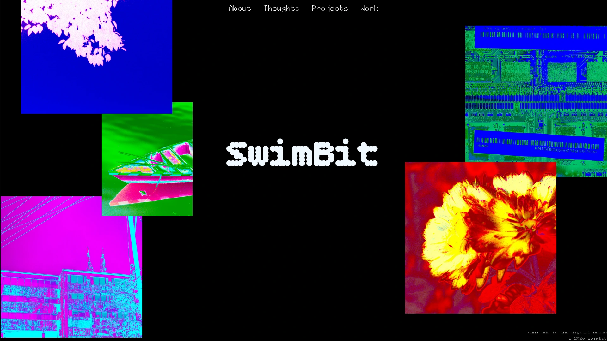

# SwimBit
Welcome to the digital archive of SwimBit

## Info
This project serves as a way to preserve/showcase my personal Art, Thoughts & Work at one place, while also providing a way to learn basic web development.
Hence everything present in this place is self-made without the use of any AI (that's why some code might look rather amateur)

The site is in it's very veryy early days, though I have tried to keep it as much simple as I possibly could. As of now it has only been optimized for larger screen and that too for landscape view only, 
further advancements, as I learn more, should bring on better usability features and *my stuff* (currently it opens up an error page while going to sections that are yet to be made)

## License & Usage
The underlying source code layout is licensed under the **MIT License**.

**Important Note on Media Assets:**
All photography, custom graphics, and images contained within this repository are the exclusive property of the author. They are **not** included in the open-source license. Unauthorized professional or commercial use of these media assets is strictly prohibited.
